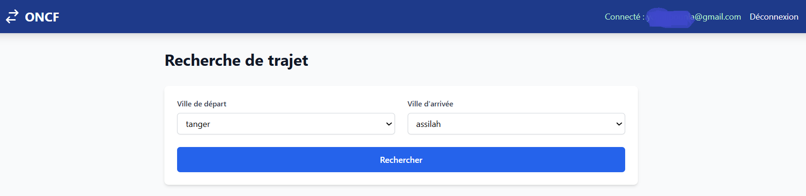
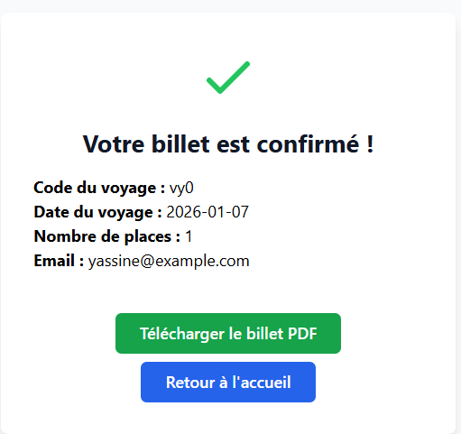

# ticket reservation system

This project is a reservation system for ONCF (Office National des Chemins de Fer), consisting of a PHP backend and an Angular frontend.

## Project Structure

- **Backend (PHP)**: Handles authentication, reservations, payments, and PDF generation.
  - `controllers/`: Contains controller classes for handling requests.
  - `models/`: Data models and database access.
  - `views/`: PHP view files for rendering pages.
  - `dompdf/`: Library for generating PDF invoices.
- **Frontend (Angular)**: User interface for login, registration, search, reservation, and payment.
  - Located in `oncf-reservation-frontend/`.
- **Database**: SQL schema in `oncf_2.sql`.

## Setup Instructions

### Backend Setup
1. Ensure PHP and Composer are installed.
2. Run `composer install` to install PHP dependencies.
3. Configure your database settings in `config.php` (not included in repo).
4. Import `oncf_2.sql` into your MySQL database.
5. Start the PHP server (e.g., using Apache or `php -S localhost:8000`).

### Frontend Setup
1. Navigate to `oncf-reservation-frontend/`.
2. Run `npm install` to install dependencies.
3. Run `ng serve` to start the development server.

## Features
- Page d'Accueil

- User authentication (login/register)

- Search for train journeys

- Make reservations

- Payment processing

- Generate PDF invoices

## Technologies Used
- Backend: PHP, MySQL, DomPDF
- Frontend: Angular,TypeScript,tailwindcss 
